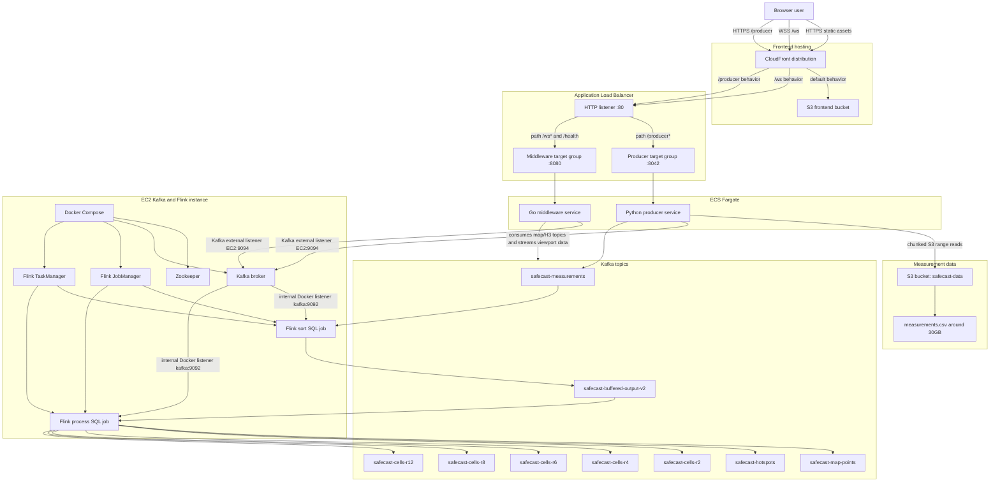

# AWS Deployment Guide

This document explains how to deploy this GitLab project to AWS.

The project currently has these parts:
- `kafka` - topic structure to save zoom levels and their points
- `frontend` - static browser frontend built with Vite/npm.
- `middleware` - Go API/WebSocket middleware that consumes Kafka messages and sends them to browser clients.
- `producer` - data-ingestion Python Kafka producer.
- `flink-lib` - Flink jars that clean, order and structure the collected data 

`measurements` -> a ~30GB .csv file
##  AWS Architecture

```text 
  AWS
   |
   |-- host measurements
   |      |
   |      v
   |   S3 bucket
   |
   |-- build frontend
   |      |
   |      v
   |   S3 + CloudFront for static frontend
   |
   |-- build middleware Docker image
   |      |
   |      v
   |   Amazon ECR
   |      |
   |      v
   |   ECS Fargate Service / App Runner
   |
   |-- build producer Docker image
   |      |
   |      v
   |   Amazon ECR
   |      |
   |      v
   |   ECS Fargate Service / App Runner
   |
   |-- Kafka
   |      |
   |      v
   |   Amazon EC2 instance
   |
   |-- Flink
          |
          v
       Amazon EC2 instance
```

### Complete setup diagram



Important deployment details that are easy to miss:

- CloudFront needs separate behaviors for `/ws*` and `/producer*` that forward to the ALB origin. The default behavior stays pointed at the frontend S3 bucket.
- The ALB uses one public listener on port `80`; it forwards `/producer*` to the producer target group on container port `8042` and `/ws*`/`/health` to the middleware target group on container port `8080`.
- Kafka has two listener addresses: Docker-internal clients use `kafka:9092`; ECS services outside the EC2 Docker network use the EC2 public DNS or Elastic IP on port `9094`.
- The producer image runs the settings API with Gunicorn and reads the large S3 CSV with ranged chunk reads instead of downloading the full file first.
- Kafka/Flink on EC2 need enough disk space and retention settings. The raw input topic `safecast-measurements` should not retain the full replay forever.
- The producer task role needs S3 read permissions for the measurement object. The EC2 role or local credentials need S3 write permissions only when replacing the dataset.
- The Kafka EC2 security group must allow port `9094` from the producer and middleware ECS task security groups.
- The ALB security group must allow public HTTP from CloudFront/the internet, while ECS task security groups should only allow traffic from the ALB security group.

## Deployment Options

Although the deployment via a CI/CD pipeline is possible via GitLab after some trail and error it was damed to be less important. In addition the manual deployment through ECS clusters can be well managed and does not require to much manual deployment work. 

### Preparing for Deployment

This step manly sets up the repository to move from local to actual deployment. For this all available variables need to be adjustable and be replaced with environment variables. For this every language has its own packages to handle this. Python and GO handles it through the os package and javasript uses the dotenv package. 

All adresses, ports, kafka topics/groups, speeds and file names among others need to be variable and settable. Because the positioning, naming and endpoints all vary from the local use to the deployment. 

In addition for to make it easier to deploy all parts separately they are divided  within the repository into different parts. Right now only the middleware and fronted is are divided the producer and docker files are all scrambled together. 

## Deployment

In this part I will shortly outline the AWS structure we chose and why. In addition I will go into the deployment process and how to replicate it and into what problems we ran. This is not a step by step guide or tutorial for AWS.

### S3 Buckets 

S3 Buckets are easy and cheep way to save static data on the cloud. For our project we host the static frontend here as well as the safecast measurements.  The easiest way of uploading data is through the AWS cli. After logging into it `aws login` and creating a general purpose bucket (for our usecase) one can upload data with this command:

```
aws s3api put-object \
 --bucket s3-bucket-name \
 --key directory \
 --body ... 
```

or in our case for the frontend we build the frontend and directly in one command delete the old and upload the new:
```
cd frontend
ENV_VARIABLE=...
npm run build
aws s3 sync dist/ s3://bucket-here/ --delete
```

for the safecast measurements we took a different approach. The download alone is 10GB when compressed and unpacket it folds out to a ~30GB  .csv file. Downloading this file just to upload it again would take a long time. We noticed that the safecast data set is hosted on a AWS S3 bucket it self so we chose to download it onto a EC2 instance unpack it there and upload it to the bucket from there. 

This saved a bunch of time and did not need free 30GB on our devices in addition the downloading from a AWS service to another as well as the upload is far quicker due to internal network routing.

## ECS Faregate

ECS clusters are very use full with them one can deploy docker images and further configure/fine tune them and redeploy without needing to reinstall or upload anything. One is also able to have multiple different versions to run at the same time or swap versions without the service going down. We use this for the middleware and the producer. Both services work well with this because they are light weight and are meant to run non stop.

A ECS cluster has has different services that can run. In our case we have two clusters with each one service. One could probably also run one cluster with two services. Each sevice then has tasks. These are the docker images. Within the service it can be defined how many tasks are desired, meaning how many are supposed to be running at once. 

We build and upload the tasks like this: 
(docker needs to be logged into aws)
```
docker buildx build --platform linux/amd64 \
  -t ....dkr.ecr.eu-central-1.amazonaws.com/producer:latest \
  -f producer/Dockerfile producer \
  --push
```
here it is then important that the correct tasks is being selected within the service to run and the service is redeployed else it can happen that the active tasks does not change.

## EC2

An EC2 instance is AWS term for VMs. The instance it self can have different CPU count RAM and disk space depending on the workload needed. After some trail and error we ferst settled for the t3.small but after deploying the full kafka and flink setup the 1 GB of memory hit it's limit. Therefore for now we use the larges free version m7i-flex.large. This instance comes with 2 CPU cores and 8GB of RAM in theory we could further optimize for size and use a smaller version but right now this is not our priority.

Deployment onto an instance is also quite simple. First all files need to be moved. This can be done via a shh connection using the scp command. After that one needs to connect to the instance via ssh and start the needed docker containers.

For our project we also enlarged the disk space to 100GB for now. We plan on running a day long tests an reevaluate the disk space after that.

## Networking

Networking is an essential part of the deployment process to make all parts of the system connect to one another and expose the parts needed so users can connect.  

### CloudFront 

Is a web service that allows for distribution of static and dynamic web content. In our case we use it to distribute our static frontend. With this deployment we also get a domain that with a https certificate. 

Because of this we are able to route our producer and middleware through the same domain with a `/producer` of `/ws` and use the certificate to have these endpoints also certified.

### Load balancer 

All this routing is done with one Application Load Balancer (ALB). This load balancer has two target groups the middleware and producer.  The ALB makes both target groups available under port 80 and routes requests accordingly depending on `/producer` of `/ws`. This ABL is set as an origin in CloudFront and behaviors to route the endpoints correctly are defined. 

## Security

This part we are still working on. Right now we have multiple security groups defined for each service. But due to ease of use during testing most security groups are to generously defined. Ideally all security groups would only define an let through what is needed and also strictly define their output.

This would go as fare as keeping the CORS definitions made in the producer and middleware strict to the safety groups so no access is given at a certain port that is not defined. 