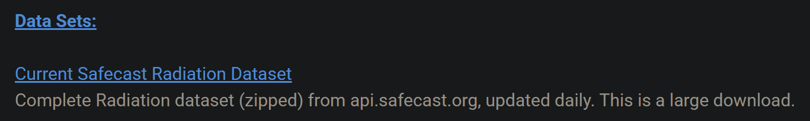

## Quickstart guide

This guide starts Kafka, Flink, creates the Flink SQL table, runs the producer, and queries the Safecast data.

## Requirements

Make sure you have:

- Docker installed
- Docker Compose installed
- Python installed
- The repository downloaded
- The included `measurements-out-short.csv` file, or the full Safecast CSV dataset

If you are using Windows, run the commands inside WSL.

## Description
A short guide to set up Kafka and Flink to read the Safecast CSV file.

## Setup
1. Get the measurements
  - Download the Safecast measurements file: https://safecast.org/data/download/
  - The ZIP is ~8 GB and expands to ~30 GB.
  - If you want a smaller dataset, use the shortened version in the repo (~100 MB).
  - Preview:
    

2. Set up WSL
  - If you do not already have WSL, run this in CMD:
```bash
wsl --install -d Ubuntu-24.04 --name BD
```

3. Set up Docker
  - Follow the Ubuntu install guide: https://docs.docker.com/engine/install/ubuntu/

4. Set up the repo
  - Download the repo, open PowerShell, and start WSL:
```bash
wsl
```
  - Navigate to the folder containing `docker-compose.yml`.
  - Start the services:
```bash
docker compose up -d
```
  - Check running containers:
```bash
docker compose ps
```
- Then launch and run the producer.py via VSC or whatever you prefer (make sure to use the correct name when using the origial data set MEASUREMENTS-OUT instead of ...-SHORT)

- Terminate your running container with:
```
docker compose down
```

